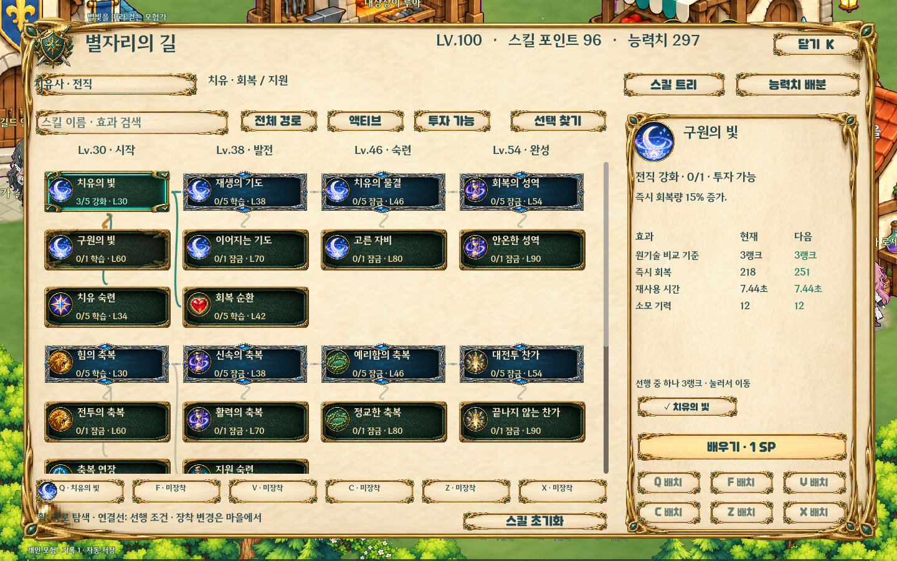
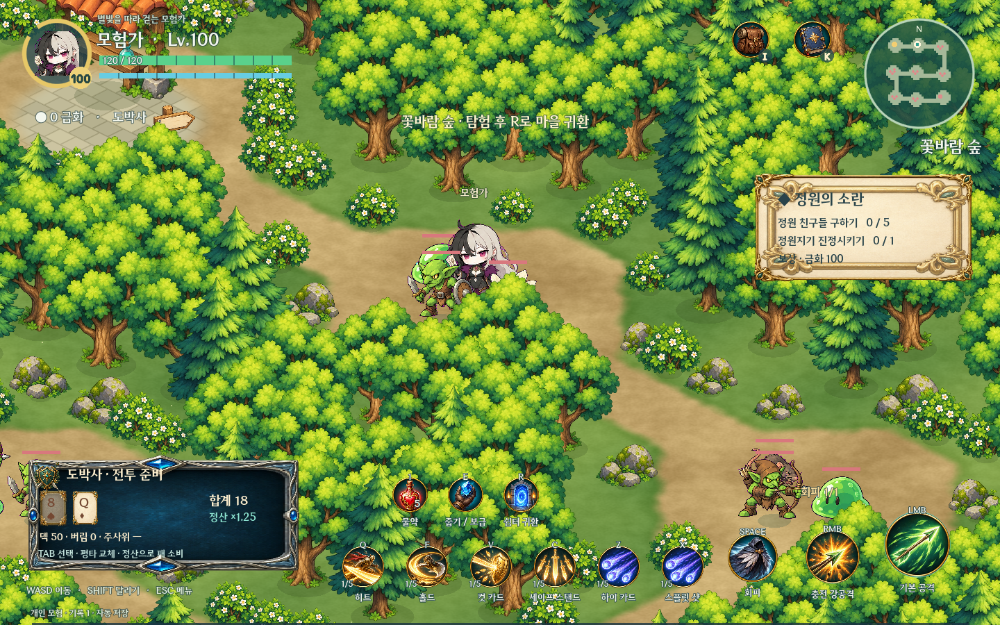
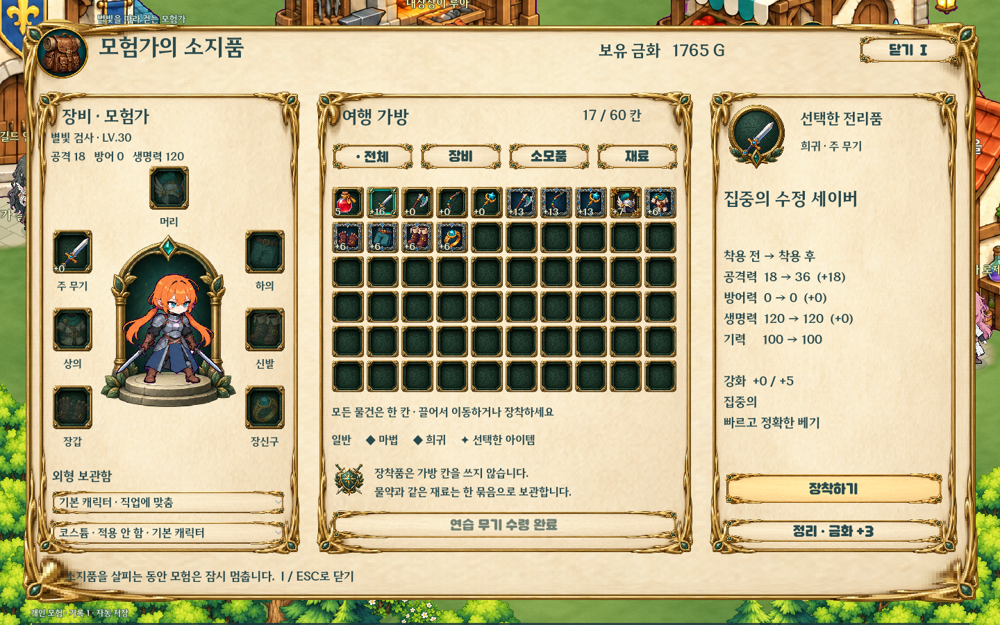
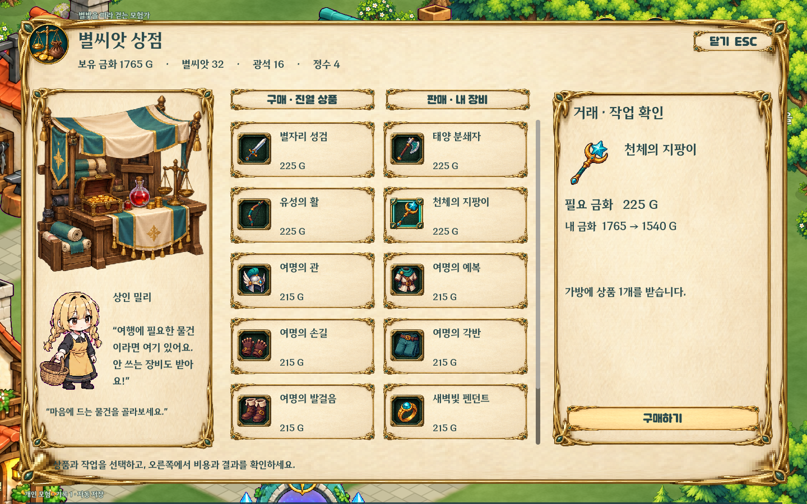

# 스텔알피지 · V0.1.1

밝은 숲과 마을을 탐험하는 개인용 싱글 액션 RPG입니다. Godot 4.6으로 탐험 → 전투 → 전리품 → 장비·스킬 성장을 구현했습니다.

## 실행

[V0.1.1 Windows 테스트 빌드](https://github.com/junochae03-bit/SRPG/releases/tag/V0.1.1)를 모두 풀고 **StelRPG.exe**를 실행하세요. PCK 파일을 같은 폴더에 둡니다. Godot 설치는 필요 없습니다. [시작 안내](docs/PLAY_CURRENT.ko.md)

소스는 Godot 4.6으로 `game/project.godot`을 열어 F5를 누르거나, `GODOT_EXE`를 지정한 뒤 **Play.cmd**를 실행합니다. 엔진·추출 원본·로그·개인 저장은 저장소에 포함하지 않습니다.

처음에는 햇살 마을에서 **I → 연습 무기 받기 → 장착**, 원정의 문에서 **E**로 던전을 고릅니다. 레벨을 올린 뒤 **K**에서 스킬과 능력치 포인트를 투자합니다.

## 직업과 성장

- 기본 5계열에서 30레벨에 계열별 3개 전직 중 하나를 선택합니다. 탱커의 정면 방어, 룬검사의 룬, 소환사의 동료, 도박사의 카드, 브레이커의 기세·반격, 무도가의 연무 등 15개 전직의 자원과 조작을 구분합니다.
- 전직별 기본 공격·다단·광역·차지·소환 계수를 조정했습니다. 회복·보호막·버프와 전직 강화가 실제 랭크에 따라 성장합니다. [측정 조건·전후 수치·변경 내용](docs/JOB_BALANCE_V011.ko.md)
- 연결형 성장 화면에 이름·랭크·해금 레벨을 표시합니다. 검색, 투자 가능 필터, 선행 경로 이동, **현재 → 다음 실제 효과**와 여섯 슬롯 관리 기능을 제공합니다.
- 기본 검사·궁수·마법사는 각 50노드, 전직은 각 30노드(12 액티브 / 6 패시브 / 12 강화), 기초 도적·격투가는 각 5노드입니다. 총 610노드입니다.
- 기본 도적·격투가는 2/8/16/24레벨에 기술을 배웁니다. 60레벨부터 전직 강화 노드가 단계적으로 열리며 최대 레벨은 100입니다. 레벨당 스킬 포인트 1, 능력치 포인트 3을 직접 배분합니다.
- Q/F/V/C/Z/X에 배운 액티브를 배치합니다. 중복 배치는 허용하지 않습니다. 마을에서 전직·장착 변경·초기화를 할 수 있습니다. 전직하면 SP를 다시 배분합니다.




## 모험과 마을

- 숲·수정 동굴·유적 3개 던전, 일반 몬스터 18종·엘리트 3종·보스 3종. 몬스터마다 다른 공격과 [드롭표](docs/DROP_TABLES_V05.ko.md)를 사용합니다.
- 장비 10계열 × 5단계, 3등급, 옵션, 대장간 강화·재련. 소지품 60칸, 장비 7부위, **모든 아이템 한 칸**, 장착 전후 비교와 큰 캐릭터 미리보기를 제공합니다.
- 대장간·상점·연금술·길드·여관과 담당 NPC. 작업대 그림, 상품 선택, 비용·결과 확인, 거래 완료 안내로 상호작용합니다.
- 승인된 카툰 몬스터와 장식 보스 체력바, GAT 기본 외형·코스튬과 스텔라이브 코스튬을 사용합니다. 전직 스프라이트·효과 원화도 포함합니다.
- DNF 비트비트체와 DNF 포지드 블레이드체, 상황에 연결한 BGM·효과음을 사용합니다. [에셋 제작·출처](docs/ASSET_SOURCES.md)




## 조작과 저장

| 입력 | 기능 |
|---|---|
| WASD / 방향키, 마우스 | 이동, 조준 |
| Shift / Space | 달리기 / 회피 |
| 좌클릭 | 기본 공격 |
| 우클릭 누르기 → 떼기 | 충전 강공격 |
| Q / F / V / C / Z / X | 장착 액티브 6칸 |
| TAB | 도박사 카드·후보 선택 |
| 1 / E / R | 물약 / 줍기·시설 대화 / 마을 귀환 |
| I / K / Esc | 가방·장비·외형 / 스킬·능력치 / 닫기·설정 |

가방·성장·시설·메뉴를 열면 전투가 멈춥니다. 공통 콤보 배율은 사용하지 않습니다. 무도가의 연무와 인파이터의 몰아침은 해당 전직의 자원입니다.

Windows 빌드는 실행 파일 옆 `saves`, 소스는 `runtime/saves`에 3개 슬롯을 저장합니다. 기존 게임을 종료한 뒤 슬롯 JSON을 새 폴더로 복사하면 이어할 수 있습니다. 이전 저장 v1~v5 이행, 자동 저장과 정상본 `.bak` 복구를 지원합니다. 검사에는 격리한 저장만 사용합니다.

## 검증과 재현

Python 3.10 이상과 Godot 4.6에서 실행합니다.

```text
python tools/verify_v01.py
python tools/fetch_windows_template.py
python tools/build_v01.py --version V0.1.1
python tools/test_export_v01.py --version V0.1.1
python tools/package_v01.py --version V0.1.1
```

[최신 검증 기록](docs/VERIFICATION_V011.json), [직업 확장 설계](docs/JOBS_INTEGRATION.md), [GDD](docs/GDD.ko.md)를 확인할 수 있습니다. 패키지는 승인된 실행 파일·PCK·안내·출처·Godot 라이선스만 포함하며, 검사 저장은 제외합니다. V0.1은 이전 릴리스로 별도 보관합니다.

개인용 프로토타입입니다. 고정 표적 밸런스 검사는 실전 회피·사거리·최적 빌드를 모두 대표하지 않습니다. 원본 4포즈를 사용하는 일부 외형과 정지 원화에 이동·공격 변형을 적용하는 몬스터가 있습니다. 장비 변경에 따른 무기 그림 교체도 모든 코스튬에 구현된 것은 아닙니다.
