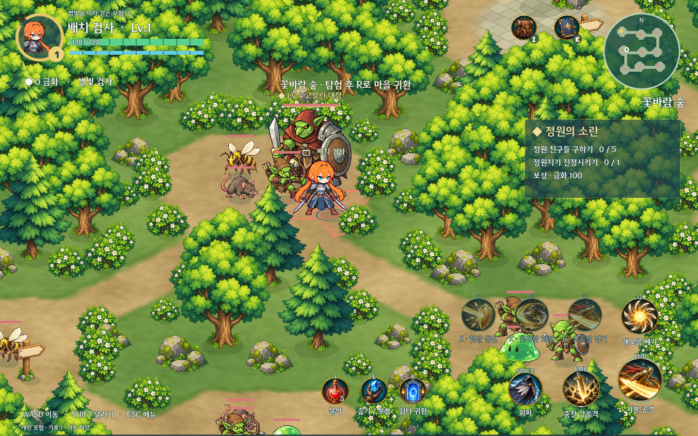

# 스텔알피지 · V0.1

> 직업 확장 소스 반영: 기본 5계열·2차 15직업, 60레벨 강화, 액티브 6칸(Q/F/V/C/Z/X), 새 스프라이트·이펙트. [사용법과 구현 범위](docs/JOBS_INTEGRATION.md). 아래 V0.1 배포 설명은 이전 릴리스 기준입니다.

밝은 숲과 마을을 탐험하는 개인용 싱글 액션 RPG입니다. Godot 4.6을 사용하며, 탐험 → 전투 → 전리품 → 장비·스킬 성장의 구조를 중심으로 만들었습니다.

## 실행

[V0.1 Windows 실행 파일 다운로드](https://github.com/junochae03-bit/SRPG/releases/tag/V0.1) → ZIP을 모두 풀고 **StelRPG.exe**를 실행하세요. 별도 Godot 설치가 필요 없습니다. 실행 파일과 PCK를 같은 폴더에 두세요. [상세 시작 안내](docs/PLAY_V01.ko.md)

소스에서는 Godot 4.6으로 `game/project.godot`을 열어 F5를 누르거나, `GODOT_EXE`를 지정한 뒤 **Play.cmd**를 실행합니다. 저장소에는 엔진·추출 원본·실행 결과·개인 저장을 포함하지 않습니다.

Windows 패키지는 실행 파일 옆 `saves`에, 소스 버전은 `runtime/saves`에 저장합니다. 슬롯은 3개이며 기존 슬롯 JSON을 게임 종료 후 새 `saves` 폴더에 복사해 이어할 수 있습니다. 같은 슬롯을 두 창에서 동시에 실행하는 방식은 지원하지 않습니다.

처음에는 햇살 마을에서 시작합니다. **I → 연습 무기 4종 받기 → 장착**, 원정의 문으로 이동해 **E**로 던전을 고르세요. 레벨을 올린 뒤 **K**에서 능력치와 스킬 포인트를 배분합니다. NPC 옆에서 **E**를 누르면 시설을 이용합니다.

## V0.1 UI와 성장

- 50개 노드에 이름·랭크·학습 상태를 상시 표시합니다. 연결 경로 강조, 검색, 액티브/투자 가능 필터와 스크롤로 원하는 기술을 찾습니다. 오른쪽에서 **현재 → 다음 효과**, 선행 기술, 포인트, F/V/C 배치를 확인합니다.
- 공격 액티브의 랭크별 기본 피해 배율은 **1.0 / 1.5 / 2.2배**입니다. 기술에 따라 범위·발사 수·지속·회복·방어·가속도 강해지고 대기시간이 줄어듭니다. 표시 수치와 실제 전투가 같은 계산 함수를 사용합니다.
- 그림으로 제작한 가죽 슬롯, 금속 테두리, 캐릭터 받침대, 양피지로 가방을 개편했습니다. 60칸 소지품, 7개 장착 부위, 큰 캐릭터 미리보기와 **착용 전후 능력치 비교**를 제공합니다.
- NPC 5명의 작업대·상점·게시판·난롯가 그림을 제작했습니다. 상품/작업 선택 → 비용·재료·결과 검토 → 실행 → 완료 안내로 구매·판매·강화·재련·조제·의뢰·숙박을 진행합니다. 원정 준비 화면도 별도 그림과 목적지 카드로 구성했습니다.

## 현재 구성

- 숲·수정 동굴·유적 3개 던전. 각 던전에 일반 적 21개체, 엘리트 1개체, 보스 1개체가 배치됩니다.
- 일반 몬스터 18종, 엘리트 3종, 보스 3종. 승인된 카툰 화풍의 슬라임·동물·곤충·고블린·오크·기계·해골을 사용합니다.
- 몬스터별 독립 드롭표 24개. 엘리트는 마법 무기, 보스는 희귀 무기를 보장합니다. 정확한 확률은 [드롭표](docs/DROP_TABLES_V05.ko.md)를 확인하세요.
- 연속 찌르기, 독침, 돌진, 화염 바닥, 냉기·거미줄 감속, 부채꼴 사격, 아군 회복, 엘리트 다단 공격. 표시된 공격 범위를 벗어나거나 회피로 피할 수 있습니다.
- 검사·궁수·마법사마다 50개, 총 150개 스킬 노드. 직업당 액티브 12개와 패시브 38개, 각 노드 3랭크. 배운 액티브를 F/V/C에 배치합니다. 기본 직업 기술 Q는 별도입니다.
- 72개 새 스킬·패시브·기능 아이콘. 가방/성장은 그림 버튼, 메뉴는 Esc로 엽니다.
- 레벨당 스킬 포인트 1, 능력치 포인트 3. 힘·민첩·지능·체력을 직접 배분합니다. 마을에서 직업 변경과 초기화가 가능합니다.
- 장비 10계열 × 5단계 = 50개 기본형, 3등급, 옵션, 대장간 +5 강화·재련. 가방 10×6, 모든 물건 한 칸, 장비 7부위 분리.
- 대장간·상점·연금술 공방·길드·여관과 담당 NPC 5명. 확대된 건물, 캐릭터를 가릴 때 부드러운 투명도 전환.
- 기본 외형 37개. 직업 기본 3종에는 걷기·달리기·기본/강공격·회피·피격을 포함한 48프레임 추가. GAT 코스튬 6종과 기존 스텔라이브 코스튬 4종을 선택할 수 있습니다.
- 보스는 기준 높이 335px, 엘리트 160~180px. 보스 전용 장식 체력바 위에 LV와 이름을 표시합니다.
- 제목/짧은 버튼은 DNF 비트비트체, 본문은 DNF 포지드 블레이드체. 선택한 음원 37개를 게임 상황에 매칭했습니다.

## 조작

| 입력 | 기능 |
|---|---|
| WASD / 방향키, 마우스 | 이동, 조준 |
| Shift / Space | 달리기 / 회피 |
| 좌클릭 | 무기별 기본 공격 |
| 우클릭 누르기 → 떼기 | 최대 0.9초 충전 강공격 |
| Q / F / V / C | 기본 직업 기술 / 배치한 액티브 |
| 1 / E / R | 물약 / 줍기·시설 대화 / 마을 귀환 |
| I / K / Esc | 가방·장비·외형 / 스킬·능력치 / 닫기·메뉴 |

가방·성장·시설·메뉴를 열면 전투가 일시정지됩니다. 콤보 배율은 제거했습니다. BGM과 효과음은 Esc에서 따로 조절합니다.

## 저장과 검증

저장 형식 v1~v5를 읽습니다. 이전 레벨에도 미사용 능력치 포인트가 지급되며, 기존 장비·성장·금화는 유지합니다. 삭제된 콤보 투자분은 강공격 강화로 이행합니다. 이전 외형은 선택형 코스튬으로 보관하며 재개 위치는 안전한 마을입니다. 자동 저장과 이전 정상본 `.bak` 복구를 지원합니다.

Python 3.10 이상과 Godot 4.6으로 `python tools/verify_v01.py`, `python tools/test_single_run.py`를 실행합니다. 검사는 격리된 저장 폴더와 기존 저장 복사본을 사용합니다. 자세한 결과는 [검증 기록](VERIFICATION.md), 설계는 [GDD](docs/GDD.ko.md), 사용 에셋은 [제작·출처 기록](docs/ASSET_SOURCES.md)에 있습니다.

현재는 개인용 프로토타입입니다. 추가 전투 프레임은 직업 기본 외형 3종에 적용되어 있고, 나머지 기본 외형과 GAT 코스튬은 원본 4포즈를 사용합니다. GAT 무기는 그림에 포함되어 있어 장비를 바꾸면 공격 방식·수치는 바뀌지만 외형의 무기 그림까지 모두 바뀌지는 않습니다. 일반 몬스터는 종류별 정지 스프라이트에 이동·공격 변형과 별도 공격 효과를 연결한 상태입니다.

## Windows 패키지 재현

Godot 4.6과 Python 3.10 이상을 준비한 뒤 `python tools/fetch_windows_template.py`, `python tools/build_v01.py`를 실행합니다. 공식 배포 템플릿의 Windows x64 항목만 내려받고 ZIP CRC를 확인합니다. `python tools/test_export_v01.py`는 새 빌드의 슬롯 3에서 실제 실행·재시작·그래픽 검사를 수행합니다. 검사 저장은 배포 ZIP에서 제외합니다. [내보내기 문서](https://docs.godotengine.org/en/4.6/tutorials/export/exporting_for_windows.html)
