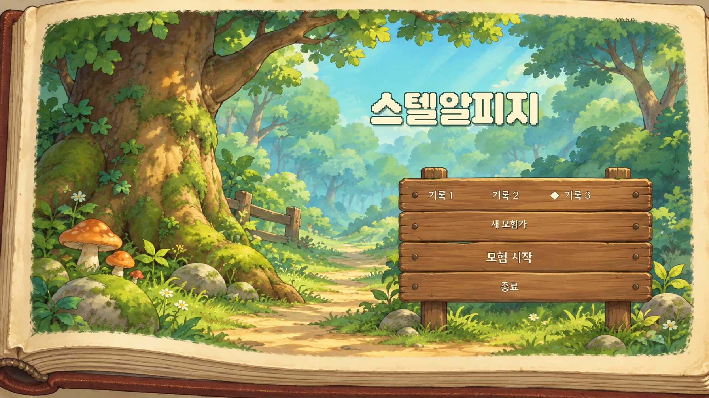
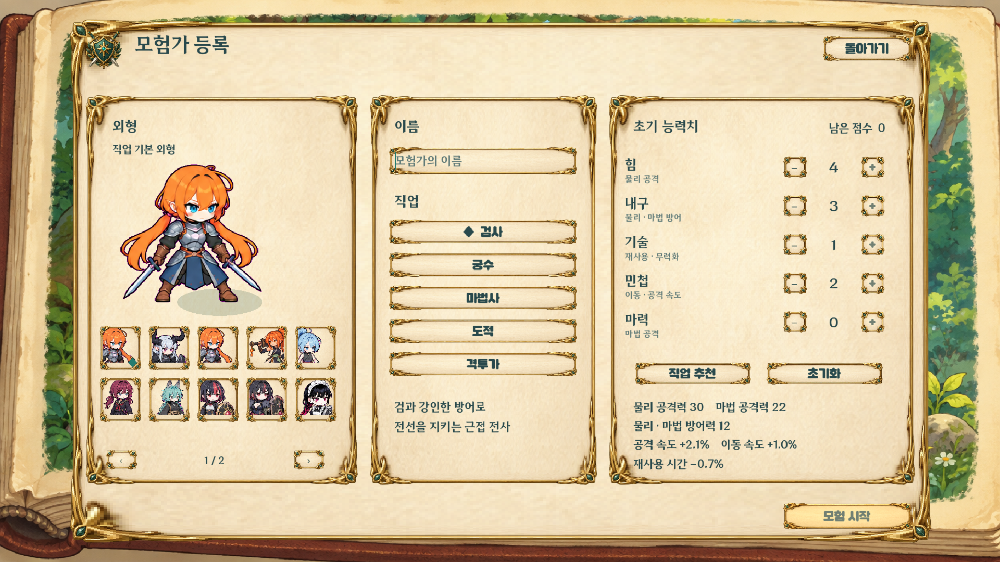
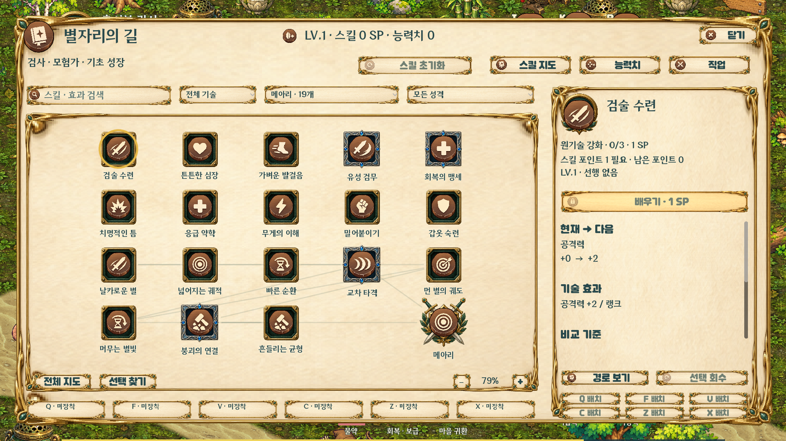
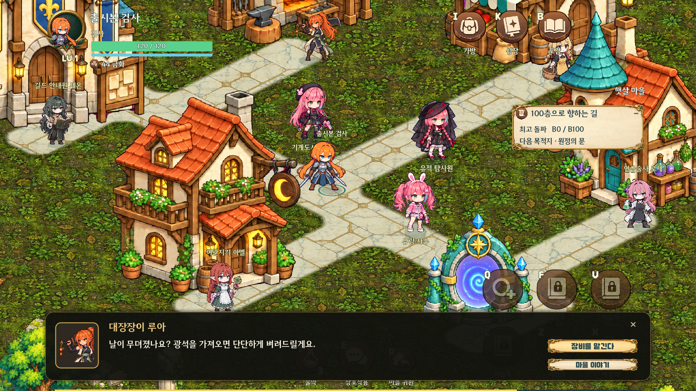

# 스텔알피지 · V0.5

밝은 판타지 분위기의 던전 탐사 액션 RPG입니다. Godot 4.6으로 꽃바람 숲 튜토리얼, 햇살 마을, 100층 던전과 레이드 보스, 전리품·직업 성장을 구현하고 있습니다. 현재 빌드는 **오프라인 싱글 플레이**이며 온라인 동시 접속과 파티 전투는 후속 작업입니다.

## 실행

[Windows 빌드·DB](https://github.com/junochae03-bit/SRPG/releases/tag/V0.5)의 게임 ZIP을 모두 풀고 **StelRPG.exe**를 실행합니다. **StelRPG.pck**를 같은 폴더에 둡니다. Godot 설치는 필요 없습니다.

빈 모험 기록을 선택하면 검사·궁수·마법사·도적·격투가 중 직업을 고르고, 그 직업에 허용된 기본 외형·코스튬과 이름, 초기 능력치 **10점**을 정합니다. 새 플레이어 코스튬은 총 30종이며 각 직업에는 무기·동작이 맞는 선택지만 표시됩니다. 직업에 맞는 **무기·머리·상의·신발 4부위가 자동 장착**되어 바로 튜토리얼을 시작합니다. 기존 기록은 **이어서 하기**로 불러옵니다. [짧은 플레이 안내](docs/PLAY_CURRENT.ko.md)

기본 창은 **1920×1080**, UI 기준 화면은 **1600×900**입니다. 기본 가지 화면의 스킬 기호는 최소 48px, HUD 스킬 버튼은 96px, 가방 칸은 64px를 기준으로 확대했습니다. 이 크기는 논리 화면 기준이며 전체 지도에서는 확대율에 따라 기호가 작아집니다.

소스 실행은 Godot 4.6에서 `game/project.godot`을 열어 F5를 누르거나, `GODOT_EXE`를 지정한 뒤 **Play.cmd**를 실행합니다. 엔진·추출 원본·로그·개인 저장은 저장소에 포함하지 않습니다.

## V0.5 변경

동화책의 숲과 나무 팻말을 사용한 타이틀에서 기록 선택과 시작에 집중합니다. 캐릭터 설정은 생성 화면으로 옮겼습니다. 마을에서는 NPC의 초상·이름·인사를 먼저 보고 대장간·상점·연금술·길드·여관 서비스를 선택합니다. HUD의 상시 조작 설명과 저장 안내를 줄이고 여섯 스킬을 위 Q/F/V, 아래 C/Z/X로 유지합니다.




**K · 별자리의 길**은 다섯 가지 중 하나를 먼저 펼치는 연결 지도입니다. 기본 검사·궁수·마법사는 한 가지에 약 19개 노드를 읽으며, 「전체 지도」를 누르면 모든 가지를 한 번에 볼 수 있습니다. 가지 선택·이동·확대, 이름·효과 검색, 성격 필터, 배울 수 있는 노드와 선행 경로를 제공합니다. 상세 화면은 얻는 변화·선택의 대가·함께 쓰는 방식을 설명하며, 원기술의 현재 랭크와 다음 랭크 수치를 비교합니다.

기존 **610개 원기술 노드**에 직업별 **45개 별자리 특화**를 더해 20개 직업에 총 **1,510개 노드**를 제공합니다. 별자리에는 사거리·효율 경로, 조건부 효과, 공격 방식을 바꾸는 핵심 선택이 포함됩니다. 추가 900개는 기존 기술에 적용하는 특화이며 새 액티브 900개를 뜻하지 않습니다.

| 직업 구분 | 직업당 원기술 | 추가 별자리 | 직업당 합계 |
|---|---:|---:|---:|
| 기본 검사·궁수·마법사 | 50 | 45 | 95 |
| 기초 도적·격투가 | 5 | 45 | 50 |
| 15개 전직 | 30 | 45 | 75 |

레벨당 1 SP, 100레벨까지 총 **99 SP를 원기술과 별자리가 공유**합니다. 원기술은 랭크당 1 SP, 별자리 기반·주요·핵심은 각각 1·3·6 SP입니다. 직업별 핵심 5개 중 최대 2개를 선택하며 배타 조합은 함께 배울 수 없습니다. 선행 노드 비용도 필요하므로 모든 선택을 한꺼번에 완성할 수 없습니다.

예를 들어 메아리는 같은 위치의 지연 타격과 재사용 시간 증가를, 단일 결의는 한 대상 집중과 기력 비용 증가를 선택합니다. 회피 후 공격, 서로 다른 기술 연결, 지원기 뒤 공격도 특화 조건이 됩니다. 핵심의 행동 변화와 기회비용은 [Path of Exile의 공식 게임 소개](https://www.pathofexile.com/game)를 참고했습니다. 스텔알피지의 밝은 색과 기존 직업별 전투 자원을 유지합니다. [V0.5 상세 설계](docs/GDD_V05.ko.md)




새 캐릭터 원화 **33종**은 **플레이어 코스튬 30종·마을 NPC 3종**으로 나눠 적용했습니다. 공통 reader가 읽는 이동·일반 공격·강공격·회피·피격·대기 포즈는 전체 **528프레임**입니다. NPC 전용 외형은 플레이어가 고를 수 없습니다. 추가 GAT 외형 24개도 무기·동작을 검토해 직업별 선택 목록에 반영했습니다. 민트 여름복과 은기사의 겹친 공격 두 포즈씩은 별도 교정 이미지 2장으로 대체하며, 총 프레임 수는 그대로입니다. UI용 둥근 나무 토큰 **168개(7시트)**를 수록했습니다. 152개는 기능·스킬·장비 부위·상태에 연결하고, 16개는 DB에 준비 영역으로 보관합니다.

배경·몬스터 **4개 팩의 사용 PNG 30장**을 통합했습니다. 배경 장식 **108개**를 튜토리얼·마을·10개 던전 생태계에 배치하고, 준비된 6개 생태계에는 일반 몬스터 외형 18종과 레이드 외형 6종의 대기·공격 키 포즈를 연결했습니다. 나머지 4개 생태계의 몬스터는 기존 원화를 유지합니다. 던전 입구·출구와 실제 보행 칸 주변은 장식 배치에서 비워 길이 가려지지 않도록 했습니다. [원화 적용 범위와 출처](docs/ASSET_SOURCES.md)

가방은 장비·보관 칸·아이템 상세의 세 영역으로 넓혔습니다. 원화 소켓과 등급 테두리를 유지하면서 수량·실제 강화 단계를 표시하며, 긴 이름·비교·추가 옵션은 상세 영역에서 스크롤합니다. 장착·사용 버튼은 아래에 고정하고 더블클릭으로도 장착·물약 사용이 가능합니다. 금속·금색 장식 안쪽에 제목과 버튼의 여백을 확보하고, 직업별 외형 목록도 스크롤되도록 정리했습니다.

완료된 장비 원화 **115개**는 직업별 무기 60개·계열별 방어구 50개·장신구 5개입니다. 가방·장비 상세·도감·바닥 전리품에서 같은 그림을 사용하며, 장비 수치와 착용 제한은 유지합니다. 추가 제작 중인 테마 시트는 이번 팩과 별도입니다.

새 바닥 팩은 숲·석조 던전·사막·얼음·용암·천공의 **6개 재료**를 사용합니다. 기존 방과 통로 좌표를 유지하고, 바닥·길의 재료를 생태계에 맞춰 연결합니다. 지면 그림과 벽의 물리 충돌은 구분하며 이번 바닥 교체가 이동 가능한 칸을 바꾸지는 않습니다.

관리용 DB에는 게임 수치뿐 아니라 적용한 그림의 **파일·영역·프레임·출처·사용처**도 저장합니다. 장비·몬스터·캐릭터·배경·타일·아이콘·효과가 어떤 원본을 쓰는지와 파일 SHA256을 SQLite/JSON에서 추적합니다. [자산 DB 사용법](docs/GAME_DATABASE.ko.md)

## 모험과 성장

기본 장비를 착용한 채 꽃바람 숲에서 시작해 적 5마리 처치 후 **R**로 햇살 마을에 도착합니다. 가방에서 입문 장비를 따로 받는 버튼과 안내는 제거했습니다. 이후 원정의 문에서 **E**로 해금한 층을 고릅니다. 지하 숲·수정·용암·빙하 등 10개 생태권을 탐사하며, 10층마다 레이드 보스와 싸우고 최종적으로 100층 아스트라에 도전합니다.

- 기본 5계열에서 30레벨에 계열별 3개 전직 중 하나를 선택합니다. 탱커의 방어, 룬검사의 룬, 소환사의 동료, 도박사의 카드, 브레이커의 기세 등 기존 전직 자원을 사용합니다.
- 능력치는 레벨당 3점입니다. **힘**은 물리 공격, **내구**는 물리·마법 방어, **기술**은 스킬 재사용 감소·무력화 증가, **민첩**은 이동·공격 속도, **마력**은 마법 공격을 담당합니다.
- 별자리 **선택 회수**는 선행 조건이 끊기는 후속 노드와 반환 SP를 미리 보여 줍니다. 회수·스킬 전체 초기화·직업 변경은 **실제 마을에서만** 가능하며, 던전 입구는 해당하지 않습니다. 직업을 바꾸면 원기술·별자리 SP가 반환됩니다. 새 직업과 맞지 않는 외형은 기본 모습으로 돌아가며 재산과 진행 기록은 보존합니다.
- 장비는 일반·레어·유니크·에픽·레전드리 테두리로 구분합니다. 무기는 현재 직업 전용, 방어구·장신구는 1차 계열 공용입니다. 가방 60칸, 장비 7부위이며 모든 아이템은 한 칸을 차지합니다.
- 레어 +2·유니크 +3은 능력치 옵션, 에픽 +4·레전드리 +5는 스킬 옵션이 열립니다. 에픽 이상은 레이드 보스 전리품입니다.
- 보스 무력화 성공 시 4초 공격 기회와 받는 피해 +20%가 적용됩니다. 레이드 HP 70%·40% 체크는 12초이며 실패 공격에는 회피 예고가 있습니다. [무력화 설계](docs/GDD_V03.ko.md)

**B · 모험 도감**은 실제 게임 데이터를 읽어 장비 2,500개 등급 변형, 몬스터 원형 24종·레이드 10종, 층별 등장·드랍과 원기술·별자리를 조회합니다. 원기술 610개와 특화 900개는 DB에서 구분합니다. [SQLite·JSON과 SQL 예제](docs/GAME_DATABASE.ko.md)

## 조작과 저장

| 입력 | 기능 |
|---|---|
| WASD / 방향키, 마우스 | 이동, 조준 |
| Shift / Space | 달리기 / 회피 |
| 좌클릭 / 우클릭 누르기 → 떼기 | 기본 공격 / 충전 강공격 |
| Q / F / V / C / Z / X | 장착 액티브 6칸 |
| TAB | 도박사 카드·후보 선택 |
| 1 / E / R | 물약 / 줍기·대화·출구 / 마을 귀환 |
| I / K / B / Esc | 가방·장비·외형 / 성장 / 도감 / 닫기·설정 |

도감·가방·성장·대화·시설·메뉴에서는 전투가 멈춥니다. 기본 공격·강공격·회피 입력은 HUD 버튼 없이 유지됩니다. 공통 콤보 배율은 사용하지 않으며 무도가·인파이터의 고유 자원은 유지됩니다.

Windows 빌드는 실행 파일 옆 `saves`, 소스는 `runtime/saves`에 3개 슬롯을 저장합니다. 게임을 종료하고 기존 슬롯 JSON과 필요하면 `.bak`을 새 빌드의 `saves`에 복사하세요. V0.3의 **저장 형식 v6**은 이름·재산·능력치·스킬·층 진행을 보존해 **v7**로 이행합니다. 원기술을 강제로 환급하지 않으며 기존 캐릭터의 생성 보너스는 0점입니다. 새 캐릭터에만 초기 10점을 제공합니다.

더 오래된 **v1~v5**는 기존 마이그레이션 규칙을 따릅니다. 이전 능력치를 5종 스탯으로 다시 배분하고 장비를 현재 직업·계열 기준으로 이행하며 튜토리얼 완료·던전 1층부터 시작합니다. v6 캐릭터에게 이 초기화를 다시 적용하지 않습니다. 자동 저장과 정상본 `.bak` 복구를 지원하며 배포에는 개인·검사용 저장을 넣지 않습니다.

## 검증과 재현

Python 3.10 이상과 Godot 4.6을 준비하고 `GODOT_EXE`를 엔진 실행 파일 경로로 지정합니다. 저장소 루트에서 실행하세요.

```text
python tools/build_database.py
python tools/build_database.py --check
python tools/verify_v01.py
python tools/fetch_windows_template.py
python tools/build_v01.py --version V0.5
python tools/test_export_v01.py --version V0.5
python tools/package_v01.py --version V0.5
python tools/package_database.py --version V0.5
```

[V0.5 최종 검증 기록](docs/VERIFICATION_V05.json)에 전체 202,684개 검사와 실제 Windows 실행 파일 검증 결과를 기록했습니다. DB는 원본 카탈로그와 전투 소스 fingerprint를 검사해 오래된 스냅샷을 검출합니다. 게임 패키지와 개발용 DB 패키지는 별도 배포합니다.

실행 파일에서 플레이어 코스튬 30종과 마을 NPC 3종, 10개 생태계의 첫 전투방, 아이콘 폴백·크로마 잔여를 확인했습니다. 원화 ID를 화면에 제출한 기록과 PNG를 함께 남깁니다. 528개 모션 프레임의 소스 reader 검사, EXE의 100층 보스 화면·완료 저장 복원, 소스 모델의 100개 층 전투 전수 검사는 서로 구분해 기록했습니다.

[에셋 출처](docs/ASSET_SOURCES.md) · [배경·몬스터 통합](docs/ENVIRONMENT_INTEGRATION_V04.ko.md) · [V0.3 설계 기록](docs/GDD_V03.ko.md) · [V0.2 설계 기록](docs/GDD_V02.ko.md)

현재는 테스트 버전입니다. 기존 외형의 일부는 이전 포즈를 유지하며, 새 몬스터는 대기·공격 키 포즈에 위치·회전 변형을 더해 움직입니다. 모든 코스튬에서 장착 무기 그림이 바뀌지는 않습니다. 온라인 동시 접속과 파티 전투는 후속 구현 예정입니다.
